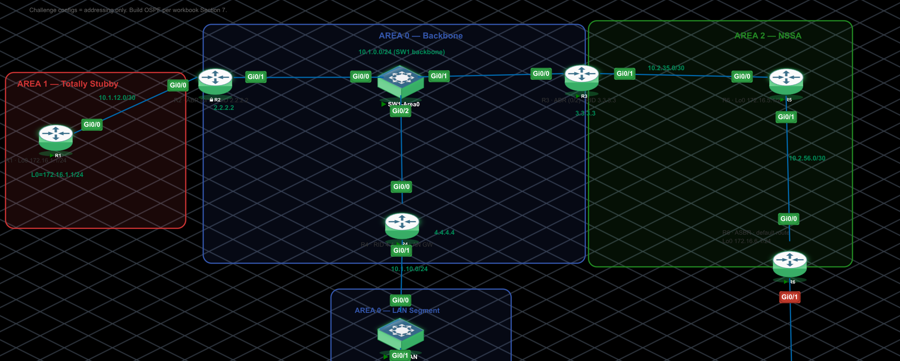

# Multi-Area OSPF

CCNP Enterprise-level lab: a three-area OSPFv2 domain covering ABR/ASBR design, totally stubby and NSSA area types, Type 7 → Type 5 LSA translation, route summarization at the area boundary, and a three-fault adjacency troubleshooting scenario. Built and verified in PNETLab on Cisco IOSv.

## Topology



R2 and R3 are the Area Border Routers. R6 is the ASBR, simulating an upstream ISP edge with a static default route to Null0.

| Device | Role | Area(s) |
|---|---|---|
| R1 | Area 1 internal router | 1 (totally stubby) |
| R2 | ABR | 0, 1 |
| R3 | ABR | 0, 2 |
| R4 | Area 0 internal router; LAN gateway for PC1; elected DR on the SW1 segment | 0 |
| R5 | Area 2 internal router | 2 (NSSA) |
| R6 | ASBR — redistributes a simulated default route | 2 (NSSA) |
| SW1 | L2 switch — Area 0 backbone multi-access segment | n/a |
| SW2 | L2 switch — Area 0 LAN segment | n/a |
| PC1 | VPCS end host — end-to-end verification | n/a |

## Lab objectives

- Design and implement a 3-area OSPF topology with two ABRs and one ASBR
- Configure a totally stubby area vs. a standard stub area, and justify the choice
- Configure an NSSA and understand Type 7 → Type 5 LSA translation at the ABR
- Summarize routes at an area boundary with `area range`
- Read `show ip ospf database` output to confirm which LSA types are present in which area, and why
- Diagnose and resolve the three most common causes of stuck OSPF adjacencies: area-type mismatch, timer mismatch, and MTU mismatch

## Devices & images used

| Component | Image |
|---|---|
| Routers (R1–R6) | Cisco IOSv |
| Switches (SW1, SW2) | Cisco IOSvL2 |
| End host (PC1) | VPCS |

Platform: PNETLab. Format: challenge lab (end-state objectives given, no step-by-step build instructions) plus a separately loaded troubleshooting scenario.

## Addressing table

| Segment | Network | Device : Interface | IP |
|---|---|---|---|
| R1 – R2 | 10.1.12.0/30 | R1 : Gi0/0 | 10.1.12.1 |
| | | R2 : Gi0/0 | 10.1.12.2 |
| Area 0 backbone (SW1) | 10.1.0.0/24 | R2 : Gi0/1 | 10.1.0.2 |
| | | R3 : Gi0/0 | 10.1.0.3 |
| | | R4 : Gi0/0 | 10.1.0.4 |
| R3 – R5 | 10.2.35.0/30 | R3 : Gi0/1 | 10.2.35.1 |
| | | R5 : Gi0/0 | 10.2.35.2 |
| R5 – R6 | 10.2.56.0/30 | R5 : Gi0/1 | 10.2.56.1 |
| | | R6 : Gi0/0 | 10.2.56.2 |
| Area 0 LAN (SW2) | 10.1.10.0/24 | R4 : Gi0/1 | 10.1.10.1 |
| | | PC1 : eth0 | 10.1.10.100 |
| R1 loopback (Area 1) | 172.16.1.0/24 | R1 : Lo0 | 172.16.1.1 |
| R5 loopback (Area 2) | 172.16.5.0/24 | R5 : Lo0 | 172.16.5.1 |
| R6 loopback (simulated ISP) | 172.16.6.0/24 | R6 : Lo0 | 172.16.6.1 |

## Configuration highlights

Representative commands reflecting the design decisions verified below — not a full running-config dump.

```text
! Totally stubby Area 1 — configured on the ABR (R2), suppresses Type 3 and Type 5
router ospf 1
 area 1 stub no-summary

! Area 1 internal router (R1) — stub flag must match on every router in the area
router ospf 1
 area 1 stub

! Summarize R1's loopback at the Area 1 ABR
area 1 range 172.16.1.0 255.255.255.0

! NSSA Area 2 — configured on both R3 (ABR) and R5 (internal)
area 2 nssa

! Summarize R5's loopback at the Area 2 ABR
area 2 range 172.16.5.0 255.255.255.0

! R6 (ASBR) — inject the existing static default into OSPF as an NSSA external
default-information originate

! R4 — advertise the LAN subnet without ever peering on it
passive-interface GigabitEthernet0/1
```

## Verification output

**Adjacencies** — all six routers reached FULL on every link; R4 confirmed as DR on the SW1 multi-access segment, R2/R3 as DROTHER.

**R1 routing table** — a single OSPF route confirms Area 1 is genuinely totally stubby:

```text
O*IA  0.0.0.0/0 [110/2] via 10.1.12.2, GigabitEthernet0/0
```

**Summarization** — 172.16.1.0/24 appears at R3, R4, R5, and R6 as one summarized route rather than unaggregated host routes.

**R3 — `show ip ospf database` (excerpt)** — confirms the NSSA translation chain:

```text
Type-7 AS External Link States (Area 2)

Link ID         ADV Router      Age         Seq#       Checksum Tag
172.16.6.0      6.6.6.6         359         0x80000001 0x005421 0

Type-5 AS External Link States

Link ID         ADV Router      Age         Seq#       Checksum Tag
172.16.6.0      3.3.3.3         307         0x80000001 0x00C50C 0
```

**End-to-end reachability from PC1**:

```text
PC1> ping 172.16.1.1
84 bytes from 172.16.1.1 icmp_seq=1 ttl=253 time=14.280 ms
84 bytes from 172.16.1.1 icmp_seq=2 ttl=253 time=11.316 ms
84 bytes from 172.16.1.1 icmp_seq=3 ttl=253 time=12.702 ms
84 bytes from 172.16.1.1 icmp_seq=4 ttl=253 time=11.432 ms
84 bytes from 172.16.1.1 icmp_seq=5 ttl=253 time=13.521 ms

PC1> ping 172.16.6.1
84 bytes from 172.16.6.1 icmp_seq=1 ttl=252 time=14.474 ms
84 bytes from 172.16.6.1 icmp_seq=2 ttl=252 time=12.489 ms
84 bytes from 172.16.6.1 icmp_seq=3 ttl=252 time=14.985 ms
84 bytes from 172.16.6.1 icmp_seq=4 ttl=252 time=13.394 ms
84 bytes from 172.16.6.1 icmp_seq=5 ttl=252 time=11.687 ms
```

Note: R1 reaches 172.16.6.0/24 via its single default route, which is correct behaviour for a totally stubby area. R2 and R4, sitting in Area 0, both carry the explicit `O E2` entry for that network.

## Troubleshooting scenario

A separate set of startup-configs loads the same topology with three faults deliberately injected — one per classic adjacency-failure category.

| Fault | Symptom | Root cause | Fix |
|---|---|---|---|
| R1 – R2 | Stuck DOWN/INIT | Area-ID mismatch — one side's network statement placed the link in the wrong area | Correct the area assignment so both sides agree |
| SW1 segment (R4) | Flapping neighbors | Hello/Dead timer mismatch against the defaults the other routers on the segment were using | Align the timers (or remove the non-default values) |
| R3 – R5 | Stuck in EXSTART/EXCHANGE | MTU mismatch — one interface left at a non-default MTU; IOS won't complete Database Description exchange on a size mismatch | Match the MTU on both sides |

The MTU fault was the one that actually required digging: both sides had already agreed on Hellos and reached 2-way, so the fault only surfaced by comparing `show interfaces` MTU on both ends rather than re-checking timers a second time.


## Key takeaways

- A totally stubby area and an NSSA solve different problems: totally stubby minimizes table size for a site with a single exit and no need for path choice; NSSA lets a site inject its own local/default route without importing externals it has no use for.
- `area range` and `summary-address` only act at the point where LSAs are being re-originated into a different area — that's why summarization has to live on the ABR, not on the router that owns the summarized network.
- When a neighbor is stuck in EXSTART/EXCHANGE but Hellos and 2-way already succeeded, suspect MTU before re-checking area type or timers again.
- Verify each stage before building the next one on top of it — multi-area OSPF failures compound quickly once you stack unverified changes.

## References

- Cisco — Understand OSPF Areas and Virtual Links
- Cisco — Configure the OSPF Not-So-Stubby Area (NSSA)
- Cisco IOS IP Routing: OSPF Configuration Guide — route summarization (`area range`, `summary-address`)
- Cisco IOS IP Routing: OSPF Command Reference — `ip ospf hello-interval`, `ip ospf dead-interval`, `ip ospf mtu-ignore`
